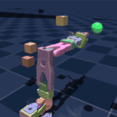
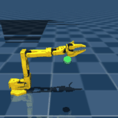
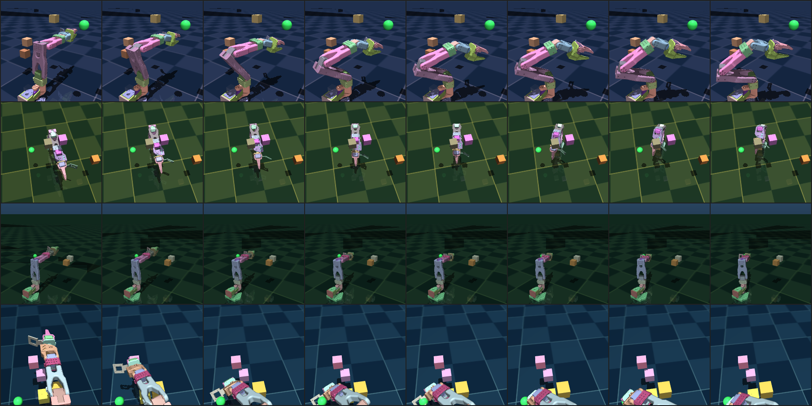

# jetspace-imitation-learning

Imitation learning and reinforcement learning on a frozen JEPA latent world model.

Teleoperated demonstrations are used to train an action-conditioned predictor on top
of a frozen V-JEPA 2 encoder. A policy is then behavior-cloned from those
demonstrations and improved by reinforcement learning inside the resulting latent
world model. The objective is a single policy that transfers to held-out variations
of a task without task-specific retraining.

**Status:** M0–M3 complete. The behaviour-cloning baseline is **90.7%** on
held-out targets, rebuilt with a committed manifest and a passing leak check
after the previous 85.7% figure failed to reproduce and was withdrawn.

The frozen V-JEPA 2 world model works, on real robot video as well as
simulation, for as long as the episodes permit testing. But the question the
project exists to answer is whether **a small dataset transfers to a large
variety of areas**, and that question now has a partial answer with a mechanism
attached:

> **Pretrained video features are what convert cheap multi-view supervision into
> generalization.** A policy head on frozen V-JEPA 2 features, trained on two
> simulated camera viewpoints, beats the same head on random convolutional
> features trained on fourteen. Random features plateau and never close the gap.

That is measured on **viewpoint**. The harder axis — transfer to **unseen
tasks** — has since been measured across eight real laboratories and the answer
is negative: pretraining on seven tasks makes an eighth *worse* — transfer beats
training from scratch in **3 of 72 folds** (p = 2.6e-17), or 1 of 53 when
restricted to folds where both arms clear the mean-action baseline
(p = 1.2e-14). Quote the restriction with the ratio; recomputing "1/53" from the
released cache without it gives 3/72 and looks like a fabrication. What survives
is narrower and sharper: pretrained features help along the **nuisance** axis,
not the **semantic** one.

Getting there cost a long run of negative results, and they are reported rather
than buried. A pre-registered instrument for predicting degradation from latent
distance works across all three simulated tasks and **fails on real
cross-laboratory data**. A simulator-alignment method was **falsified by its own
registered falsifier**. A learned viewpoint canonicalizer was **beaten by the
baseline it was built to improve on**. A calibrated camera ruler was
**withdrawn** once its simulated scale was measured against reality. Each is in
[Findings](#findings) with the number that killed it.

The methodology is the part that generalises: predictions registered in writing
before the data exists, falsifiers named in advance, and a
[ledger](docs/ledger.md) of twelve failures with the diagnostic that caught each
one. See [`CONTRIBUTING.md`](CONTRIBUTING.md) to pick something up.

<p align="center">
  
</p>

<p align="center"><em>The SO-101 reaching for the green target. Every episode
resamples the world: camera viewpoint, lighting, surface colours, clutter, link
masses, joint friction, servo gain and control latency. Nothing here is a fixed
scene — that is the point.</em></p>

<p align="center">
  
</p>

<p align="center"><em>The M2 behavior-cloning policy on held-out targets it never
saw in training. The rebuilt policy reaches <strong>90.7%</strong> with a
committed manifest and a passing leak check; the 85.7% figure it replaced did
not reproduce and was withdrawn. Four earlier attempts failed at 24.7%, 9.3%,
3.7% and 22.0%; <a href="docs/ledger.md">the ledger</a> records why.</em></p>

---

## Table of contents

- [Verify our numbers](#verify-our-numbers)
- [Findings](#findings)
- [Novelty](#novelty-what-is-actually-unclaimed)
- [Overview](#overview)
- [Approach](#approach)
- [Hardware and platform constraints](#hardware-and-platform-constraints)
- [Setup](#setup)
- [Seeing what it does](#seeing-what-it-does)
- [Verifying the installation](#verifying-the-installation)
- [Troubleshooting](#troubleshooting)
- [Repository layout](#repository-layout)
- [Branching model](#branching-model)
- [Roadmap](#roadmap)
- [To do](#to-do)
- [Documentation](#documentation)
- [References](#references)
- [License](#license)
- [Disclosure](#disclosure)

---

## Verify our numbers

Every figure the paper reports can be re-derived from the committed artifacts
in one command. No GPU, no Docker, no model downloads — numpy and scipy, a few
seconds:

```bash
pip install numpy scipy
python scripts/verify_paper_numbers.py --verbose
```

It reads `cache/*.json` and checks each headline in
[`docs/paper-numbers.md`](docs/paper-numbers.md) — the canonical record the
paper is written from — against the data: per-axis correlations, the
probe/reference-MSE identity, where the untrained control ranks on every axis,
the encoder ranking with its paired bootstrap intervals, the CortexBench
control, and the corroborating experiments. **128 checks; it exits non-zero if
any of them disagrees.**

It also asserts that six **retracted** claims stay false; they are listed in
[`paper-numbers.md`](docs/paper-numbers.md) §7, and the script fails if a future
edit resurrects one. Re-running the current analysis at the old encoder counts
shows those retractions came from **defects that were found and fixed**, not
from small samples: at an identical nine encoders the corrected code gives push
0.489 where the original run gave 0.317, and pickplace 0.217 where it gave
0.733. Sample size only sharpens the magnitudes and never moves a verdict
(§6a).

The same script runs in CI on every push
([`.github/workflows/verify-numbers.yml`](.github/workflows/verify-numbers.yml)),
so the paper cannot silently drift from the data behind it.

To rebuild the figures and LaTeX tables from the same artifacts:

```bash
python scripts/make_figures.py --out paper/figures
```

---

## Findings

Everything below is measured, committed, and reproducible from a script in
`scripts/`. Where a claim was later retracted, the retraction is recorded next
to it rather than the claim being deleted. Most predictions here were
pre-registered before the data existed, and **most of them failed** — that list
is longer than the list of successes, and it is kept in full.

Claims are additionally annotated against an adversarial literature check
(§ [Novelty](#novelty-what-is-actually-unclaimed)), because "we measured it" and
"nobody had measured it" are different statements and only one of them needs
citations.

### What transfers across viewpoint, and what carries it

A policy head trained on simulated camera viewpoints, evaluated on 8 viewpoints
held out of every training batch ([`docs/prereg-e8.md`](docs/prereg-e8.md)):

| viewpoints trained on | V-JEPA 2 | random CNN |
|---|---|---|
| 1 | 0.777 | 1.205 |
| 2 | **0.497** | 0.879 |
| 4 | 0.434 | 1.014 |
| 7 | 0.334 | 0.825 |
| 10 | 0.295 | 0.716 |
| 14 | **0.215 ± 0.003** | **0.685 ± 0.037** |

Normalised action MSE; **1.0 = no better than predicting the mean action**.
Three seeds, intervals separated at full coverage.

- **V-JEPA with 2 viewpoints beats random features with 14** — seven times fewer
  viewpoints, for a better result.
- **Random features plateau near 0.69** and never approach V-JEPA's 0.215.
- At 45° elevation the single-viewpoint policy scores **1.610**, worse than
  predicting the mean; the 14-viewpoint one scores **0.182**.

This reconciles with E6's negative rather than contradicting it: pretraining
buys nothing from single-view data, and what it buys is the **ability to exploit
multi-view supervision**, which simulation provides for free.

**That claim did not survive a wider comparison.** E11
([`docs/e11-results.md`](docs/e11-results.md)) ran nine frozen encoders at
matched pooling. V-JEPA 2 leads at 0.251 against DINOv2's 0.284, but the two
**do not separate**: the paired per-cell comparison (3 seeds × 8 held-out
poses) gives a mean difference of −0.033 with a 95% bootstrap CI of
[−0.069, +0.006], V-JEPA ahead in 16 of 24 cells, sign test p = 0.15. An 87M
image encoder from 2023 matches a 326M video encoder from 2025, so *"video
pretraining specifically buys viewpoint generalization"* is **not supported**.

What E11 found instead is sharper. Probing the same frozen features
**in-distribution** ranks them almost oppositely to the held-out ranking
(Spearman **ρ = −0.317**): V-JEPA 2 has the *weakest* features of all nine
(R² 0.410, below random) and is the most viewpoint-robust, while VC-1 has the
*second-strongest* (R² 0.627) and collapses to worst.

> **In-distribution feature quality and viewpoint robustness are different,
> nearly independent properties. A linear probe — what most encoder comparisons
> report — cannot predict which encoder survives a camera move.**

Also: **DINOv3 (2025) loses decisively to DINOv2 (2023)**, and the
robotics-specific **VC-1 is the least viewpoint-robust of all nine**, echoing
Burns et al. (CoRL 2024).

### What does not transfer across tasks

Eight real laboratories, eight different tasks, leave-one-out, K demonstrations
of the held-out task ([`docs/e9-results.md`](docs/e9-results.md)):

| K | scratch | transfer | transfer wins |
|---|---|---|---|
| 1 | 1.334 | 1.416 | 2 / 24 |
| 2 | 0.680 | 0.740 | **0 / 24** |
| 4 | 0.416 | 0.475 | 1 / 24 |

Restricted to the 53 folds where both baselines clear the mean-action floor,
**transfer wins 1 of 53, p = 1.2e−14**. Pretraining on seven other tasks makes
the eighth *worse*.

The same experiment contains the one positive that survives. Comparing only the
**scratch** arms — no transfer, just which frozen encoder the head sits on —
V-JEPA beats random features in **39 of 53 folds, p = 8.0e−04**. A frozen video
encoder makes an unseen task learnable from fewer demonstrations; it does not
make knowledge of other tasks transfer.

> **Pretrained video features help along the nuisance axis, not the semantic
> one.**

### The distribution-shift ladder

Every rung recomputed in **one space** — one estimator, one `pca_dim`, one
pooling — because Fréchet has no absolute scale
([`docs/e2-results.md`](docs/e2-results.md)).

| rung | n | mean | × null |
|---|---|---|---|
| null (self, split by episode) | 7 | 82.7 | 1.0 |
| **session** (same lab, same camera, different day) | 6 | **177.8** | 2.2 |
| sim camera (simulator, 5 viewpoints) | 10 | 531.9 | 6.4 |
| **camera** (same lab, same session, 2 viewpoints) | 8 | **1005.8** | 12.2 |
| sim→real, domain-randomised | 8 | 1037.6 | 12.6 |
| **cross-lab** (different lab, robot, task) | 28 | **1228.5** | 14.9 |
| sim→real, no randomisation | 8 | 1271.8 | 15.4 |

- **Session drift is real.** Lab H's four sessions on one camera sit at 177.8
  against that lab's own null of 39.6 — 4.5×, disjoint ranges, p = 0.0105.
  Against the *pooled* null it looks like 2.2×; the wrong control halves it.
- **Domain randomisation works.** A randomised simulator sits closer to a real
  lab (1037.6) than two real labs sit to each other (1228.5).
- **Viewpoint is most of the domain gap** — camera change within one lab reaches
  ~82% of a full cross-laboratory shift.

Estimator caveat: `gap_between` fits its basis on its first argument, so it is
directional. Asymmetry is **proportional** to the magnitude measured (22–32%
across families), not an absolute floor. Differences below ~30% of the gaps
compared are not claimable.

### Most nuisance axes cannot rank encoders at all

22 frozen encoders crossed with 8 nuisance axes on 2 tasks — 1,452
encoder–condition arms ([`docs/paper-numbers.md`](docs/paper-numbers.md) is the
canonical record; [`docs/audit.md`](docs/audit.md) is the verification).

Every axis carries an **untrained CNN as a control**. Where that control fails
to land in the worst third, the axis cannot separate learned features from
random ones, and any ranking computed on it is noise:

| axis | push (n=22) | pickplace (n=20) | status |
|---|---|---|---|
| lighting | 22/22 | 20/20 | discriminates |
| texture | 21/22 | 20/20 | discriminates |
| exposure | 22/22 | 20/20 | discriminates |
| clutter | 10/22 | 10/20 | **excluded** |
| noise | 13/22 | 13/20 | **excluded** |
| defocus | 1/22 | 8/20 | **excluded** |
| compress | 1/22 | 4/20 | **excluded** |
| lowres | 1/22 | 4/20 | **excluded** |

> **Five of eight axes cannot rank encoders — the same five on both tasks.** On
> three push axes the untrained control ranks *first of 22*. This is a count,
> not a correlation, so no sample-size caveat applies to it.

A second defect is algebraic. Probe R² and reference MSE share a numerator and
a denominator across encoders, so one is an exact monotone transform of the
other — **ρ = −1.000 on all 16 cells**. Ranking robustness by *absolute*
held-out error therefore partly re-measures baseline fit, and switching to
relative degradation reverses the sign on every valid push axis.

On the six cells that survive both checks, ranked by relative degradation
(1.00 = no loss under shift), with paired bootstrap intervals:

| encoder | mean | 95% CI | P(top 3) |
|---|---|---|---|
| **vjepa2** | 1.069 | [0.978, 1.186] | 0.84 |
| **aimv2** | 1.093 | [0.962, 1.248] | 0.79 |
| **dinov3** | 1.120 | [1.015, 1.227] | 0.70 |
| … | | | |
| vc1 | 2.564 | [1.343, 4.019] | 0.00 |
| vc1-large | 2.899 | [1.495, 4.940] | 0.00 |
| *random (control)* | 22.517 | [6.044, 51.249] | 0.00 |

> **A top group — V-JEPA 2, AIMv2, DINOv3 — is internally inseparable, and each
> member beats VC-1 with an interval excluding zero.** VC-1, the
> robotics-specific encoder, ranks 14th of 20. It does clearly beat untrained
> features (−19.9, CI [−47.2, −4.3]); an earlier 15-encoder analysis could not
> separate the two, and that claim was withdrawn.

The same control run on **CortexBench's own Adroit demonstrations passes** —
the untrained arm ranks 11/12 and 12/12. The failure is specific to axes built
by *corrupting a reference condition*, not to nuisance evaluation in general.
VC-1 nonetheless ranks below a plain ImageNet ViT there too, a third
independent corroboration.

**The registered E12a prediction is not supported as stated.** push gives mean
|ρ| = 0.407 against a ≤ 0.4 bound (fails by 0.007, the third time this
threshold landed inside its own margin); pickplace gives 0.048 and holds. The
split between them is *not* statistically real — the paired task difference
spans zero on seven of eight axes. The threshold was anchored to a prior effect
size and never powered against the design, which is disclosed rather than
explained away.
### Latent gap predicts task success, at half the strength it predicts internals

The only result here measured in **task success** rather than action-prediction
error ([`docs/r2-results.md`](docs/r2-results.md)). A behaviour-cloning policy
trained at one camera, run at 22 displaced viewpoints, unadapted and untold.

| | |
|---|---|
| reference pose success | 46.7% ± 10.9% |
| Spearman ρ, gap vs success | **−0.516**, 95% CI **[−0.743, −0.137]** |
| registered | ρ ≤ −0.6 — **fails** |

The threshold is missed and reported as missed. But the interval **excludes
zero**, so the relationship is real and simply weaker than registered. Against
the world-model numbers on the same poses (ρ −0.85 to −0.92):

> **Latent distance predicts behaviour at roughly half the strength with which
> it predicts world-model internals** — a loose proxy for what a policy will do,
> not a blind one.

This bounds every action-MSE result elsewhere in this repository, including the
encoder table.

### The instrument works in simulation and does not survive real data

Latent gap predicting world-model degradation
([`docs/prereg-h1.md`](docs/prereg-h1.md), [`docs/h1-results.md`](docs/h1-results.md)):

| | push | pickplace | reach |
|---|---|---|---|
| ρ, worst seed | −0.844 | −0.877 | −0.828 |
| **H1a** out-of-sample R² ≥ 0.5 | 0.577 ✅ | 0.560 ✅ | 0.465 ❌ |
| **H1b** every seed ρ ≤ −0.6 | ✅ | ✅ | ✅ |
| **H1e** family CI excludes −0.6 | ✅ | ✅ | ❌ |

**H1c holds** across all three tasks; **H1f holds** — Fréchet, MMD² and centroid
agree to within 0.04. **H1d, the registered differentiator, failed**: trained on
one real lab and evaluated on seven others, ρ = **+0.116**, 95% CI
**[−0.193, +0.501]**. Controlling for action mismatch *raises* ρ to +0.220, so
the weakness is real, not masked
([`docs/h1d-results.md`](docs/h1d-results.md)).

### Novelty: what is actually unclaimed

Four independent adversarial literature searches, each instructed to find the
paper that scoops the claim rather than to confirm it. Recorded because a
result nobody else has published and a result everybody has are worth different
amounts, and the difference is not visible from the number alone.

| claim | status |
|---|---|
| DR sits closer to a real lab than two real labs do | **no prior art found** |
| Session drift, 4.5× its own noise floor | **no prior art found** |
| 2 views pretrained beats 14 views random | **no prior art found**, counter-evidence exists |
| Few-shot transfer hurts across unharmonised labs | **no prior art found**, contrarian |
| Viewpoint dominates the domain gap | scooped — Factor World, ICRA 2024 (arXiv:2307.03659) |
| Multi-view training → viewpoint generalization | scooped — Tobin 2017, Sadeghi & Levine 2016 |
| Frozen pretrained > frozen random features | scooped — arXiv:2203.03580 (ICML 2022), arXiv:2107.03380 |
| Pretraining improves sample efficiency | scooped — R3M, MVP, CortexBench |
| Action normalisation needed for cross-dataset transfer | scooped — RT-X, Octo, CrossFormer |

Known counter-evidence that any write-up must address rather than omit:
**arXiv:2510.02268** finds pretraining has minimal effect on view-invariant
policy learning; **arXiv:2212.05749** (ICML 2023) finds learning-from-scratch
competitive with R3M/MVP; and **arXiv:2507.05331** (*Science Robotics* 2026)
finds multi-task pretraining *helps* few-shot learning — the opposite of E9,
on same-lab data with harmonised action conventions.

### Things that turned out not to be true

Kept because they cost real time and the diagnostics generalise. Every item was
believed, written down, and measured false.

- **"Session noise equals a 21.8° camera rotation."** **Withdrawn.** The ruler
  was built in simulation and read against real rungs; real camera change
  produces **1.89×** the latent shift of simulated (p = 0.0019).
- **"Camera rotation cannot produce a cross-lab-sized gap."** R1's refutation of
  N1b, itself **refuted** — and N1b is not reinstated either, since the
  difference is smaller than the estimator's directional noise. **Neither claim
  is supported.**
- **"Feature resolution bounds achievable precision."** **Falsified.** Five arms
  spanning a 4× range of feature grids all land at 7.68–7.78 cm.
- **"CEM alignment tunes a simulator toward a real lab."** **Falsified by its own
  registered primary falsifier** — random search matched it, and held-out
  performance got *worse* ([`docs/a1-results.md`](docs/a1-results.md)).
- **"A learned canonicalizer corrects viewpoint in latent space."** Proposed and
  **falsified in one run** by the baseline it was built to beat.
- **"Random CNN beats frozen V-JEPA."** Held on push, **reversed on pickplace**.
- **"Domain randomisation widens the sim-to-real gap."** One reference dataset;
  **reversed against eight.**
- **"Byte-identical action space."** Asserted for weeks, **false when measured.**
- **"The world model is action-blind on push."** Computed on 2 of 60 episodes.

### Ways these measurements go wrong

| defect | magnitude | diagnostic |
|---|---|---|
| **A treatment run before its ceiling was measured** | 36/36 unanimous sweep between two non-functional arms | `check_action_ceiling.py` |
| **Horizon exceeds episode length**, silently scoring zero | fired **4×**; pickplace kept 1 of 4 episodes at h=48 | `check_horizon.py` — refuses, does not warn |
| **Encoder window tiling** leaks a periodic comb into latents | 1.44–1.67× in sim, **1.014× in real** | `check_chunk_phase.py` |
| **PCA decides whether the comb matters** | 0.003 at full width, **0.055 under PCA-128** | `diff_checkpoints.py` |
| **Action spaces are not interchangeable** across labs | **70–238×**, zero-offsets differ by ~140 units | `check_action_spaces.py` |
| **Trained encoders collapse** and win on raw loss | val loss **1000× lower**, gain 0.74× | `train_joint_cnn.py` |
| **Verdicts printed off data with no dynamic range** | R2 declared failure from a 3.3%-success policy | `FLOOR` guard in `run_r2_task_success.sh` |
| **Ratio metrics dividing by training-set fit** | penalise the arm that memorises harder | `e7_absolute.py` |
| **Encoder arms silently unmatched** | `zip()` truncates without complaining | `check_arm_parity.py`, `check_encoder_parity.py` |
| **Subset selection confounded with coverage** | n=10 spanned less range than n=7 | `linspace` subset in `e8_canonicalize.py` |

Each was found by a check, not by inspection, and each check is in the
repository. [`docs/ledger.md`](docs/ledger.md) records thirteen failures with
the diagnostic that caught each one.

---

## Overview

The project combines four ideas that are usually pursued separately:

| Component | Role |
|-----------|------|
| Imitation learning | Bootstraps a policy from teleoperated demonstrations |
| World model | Predicts future states so the policy improves without real rollouts |
| JEPA | Supplies the representation the world model predicts in |
| Reinforcement learning | Improves the policy beyond demonstration quality |

The central design decision is that **the JEPA is not trained from scratch.**
Training a video JEPA requires on the order of one million video-hours and
cluster-scale compute. V-JEPA 2 is already pretrained on more than 1M hours of
internet video, and its action-conditioned variant (V-JEPA 2-AC) already learned
action-conditioned latent prediction from under 62 hours of robot teleoperation
data. This project freezes that encoder and spends its compute on the part that is
genuinely open.

## Approach

```
  teleop demos
       |
       v
  +----------------------------+
  |  V-JEPA 2 encoder (FROZEN) |   pretrained on >1M h video
  +----------------------------+   run once, cached to cache/latents/
       | z_t
       v
  +----------------------------+
  |  action-conditioned head   |   z_t, a_t -> z_t+1        <- trained here
  +----------------------------+
       |
       +--------------------+
       |                    |
       v                    v
  +----------+      +---------------------+
  | BC (M2)  |----->| RL in latent        |   <- primary contribution
  |          | warm | imagination (M4)    |
  +----------+ start+---------------------+
```

V-JEPA 2-AC plans using the Cross-Entropy Method: at each timestep it samples action
sequences, rolls each through the world model, and selects the best. This is
expensive at inference time and myopic over long horizons.

This project replaces that planner with a **policy learned inside the frozen latent
world model** — Dreamer-style imagination on a JEPA backbone rather than a
reconstructive RSSM. The policy is warm-started by behavior cloning (imitation),
improved on imagined rollouts (reinforcement learning), and optionally fine-tuned
online with AWAC, which is designed for the offline-demonstrations-then-online-improvement
setting.

Because the encoder is frozen, it requires no gradients and no optimizer state, and
its outputs are deterministic. The encoder is therefore run once across the dataset
and its embeddings cached to disk; all subsequent training reads latents rather than
pixels. This is what allows the project to fit on a single 16 GB consumer GPU.

Full detail: [`docs/architecture.md`](docs/architecture.md).

## Hardware and platform constraints

Primary development machine:

| Component | Specification |
|-----------|---------------|
| GPU | AMD Radeon RX 9070 XT, 16 GB, `gfx1201` |
| CPU | AMD Ryzen 7 9800X3D, 8C/16T |
| Memory | 32 GB |
| Host OS | Windows 11 |
| Runtime | WSL2, Docker, ROCm 7.2.4 |

Two constraints follow from this and shape the entire repository.

**Isaac Sim cannot run on this machine.** Isaac Sim 5.1 requires an NVIDIA RTX GPU
(minimum RTX 4080; cards without RT cores are unsupported). There is no AMD path.
MuJoCo is therefore the default simulator, and `src/jetspace/envs/base.py` exists so
that an Isaac backend can be added as a sibling rather than a fork.

**ROCm reaches the GPU differently under WSL2.** On native Linux, ROCm uses the
Kernel Fusion Driver at `/dev/kfd`. That device does not exist under WSL2; the GPU is
reached through `/dev/dxg` via AMD's ROCDXG translation layer, which requires the
Windows driver libraries to be bind-mounted into the container. `docker/compose.yaml`
provides a separate profile for each case.

## Setup

### Prerequisites (Windows host)

1. **AMD Adrenalin driver 26.2.2 or newer.** ROCDXG depends on a current Windows
   driver. Verify the version in the Adrenalin control panel.
2. **WSL2 with Ubuntu 24.04:**
   ```
   wsl --install -d Ubuntu-24.04
   ```
3. **ROCm and librocdxg inside the distro** — a current Windows driver is not
   sufficient on AMD, unlike NVIDIA:
   ```
   bash scripts/install_rocm_wsl.sh
   ```
4. **Docker Engine inside the distro** (`curl -fsSL https://get.docker.com | sudo sh`).
   Docker Desktop cannot be used for GPU work here: it resolves bind mounts in its
   own VM, which has no `/opt/rocm`. See [`docs/setup.md`](docs/setup.md).

ROCm 7.2.1 is the minimum version supporting RX 9000-series GPUs under WSL. The
container image pins ROCm 7.2.4, paired with librocdxg 1.2.0.

### Build and run

From the repository root, inside WSL:

```bash
docker compose -f docker/compose.yaml --profile wsl2 build
```

```bash
docker compose -f docker/compose.yaml --profile wsl2 run --rm dev-wsl
```

### Available profiles

| Profile | Service | Use case |
|---------|---------|----------|
| `wsl2` | `dev-wsl` | Windows 11 with WSL2 and a Radeon GPU. Uses `/dev/dxg` and the ROCDXG bridge. |
| `linux` | `dev` | Native Linux. Uses `/dev/kfd` and `/dev/dri`. |
| `cpu` | `dev-cpu` | No GPU. Simulation and dataset work run; training will be very slow. |

### Native Linux alternative

If WSL2 proves unreliable, native Ubuntu 24.04 on bare metal uses the same image:

```bash
docker compose -f docker/compose.yaml --profile linux run --rm dev
```

### Working without Docker

Not recommended, but supported. Install PyTorch from the ROCm wheel index **before**
installing this package, so that pip does not substitute a CPU or CUDA build:

```bash
pip install torch --index-url https://download.pytorch.org/whl/rocm7.2
```

```bash
pip install -e ".[dev]"
```

Python 3.11 or 3.12 is required. Python 3.13 and newer are ahead of the ML stack.

## Seeing what it does

Numbers tell you whether a policy works; pictures tell you why it doesn't.

```bash
python scripts/render.py --data data/episodes/reach
```

```bash
python scripts/render.py --checkpoint checkpoints/bc_seed0.pt
```

Both write into `renders/`:

| File | What it shows |
|------|---------------|
| `contact_sheet.png` | One row per episode, time running left to right |
| `episodes.mp4` | The same episodes as video, with a gap between attempts |

The contact sheet is the more useful of the two. A video shows one run; the grid
shows twenty at once, which is how you notice that the arm always drifts one way,
or that a whole cluster of target positions never gets reached. It has already
paid for itself twice — it revealed that the camera was mounted nearly edge-on to
the arm's plane of motion, and later that a trained policy was executing the same
motion regardless of where the target was.



One row per episode, time left to right. Note that no two rows share a lighting
setup, a viewpoint, or the same clutter.

## Verifying the installation

Always run this first, inside the container:

```bash
python scripts/check_env.py
```

The script confirms that:

1. The correct GPU device node is present: `/dev/dxg` under WSL2, `/dev/kfd` natively.
2. PyTorch is a ROCm build and not a substituted CPU or CUDA wheel.
3. The GPU is visible, with its architecture and VRAM reported.
4. A real bfloat16 matmul executes on the device. An availability check alone is not
   sufficient, since `torch.cuda.is_available()` can succeed on systems where kernel
   launches subsequently fail.
5. MuJoCo steps physics and renders headlessly through EGL.

The script exits non-zero on any required failure, making it suitable as a CI gate.

## Troubleshooting

| Symptom | Cause and resolution |
|---------|----------------------|
| `/dev/dxg` missing | Not running under WSL2, or the Adrenalin driver is older than 26.2.2. |
| `librocdxg.so` not mounted | Run `scripts/install_rocm_wsl.sh` in the distro, and use Docker Engine rather than Docker Desktop. |
| Files written by the container are root-owned | `export DOCKER_UID=$(id -u) DOCKER_GID=$(id -g)` if your account is not uid 1000. |
| ROCm build check fails | A `pip install torch` replaced the ROCm wheel. Reinstall from the ROCm index. |
| GPU not visible to PyTorch | Adrenalin driver too old, or the GPU is not exposed to WSL. |
| Matmul fails although the GPU is visible | ROCm and driver version mismatch. Check `rocm-smi` against the ROCm compatibility matrix. |
| Headless render fails | `MUJOCO_GL` unset, or EGL libraries missing. The image sets `MUJOCO_GL=egl`. |
| Import errors on the Windows host | Work inside the container. The host runs Python 3.14, which is unsupported. |

## Repository layout

```
docker/            ROCm image and compose profiles (wsl2 / linux / cpu)
scripts/           check_env.py, collect_demos.py, train_bc.py,
                   eval_policy.py, verify_replay.py, render.py
src/jetspace/
  envs/            RobotEnv abstraction and MuJoCo backend
  data/            teleoperation capture, dataset, latent caching
  models/          frozen encoder, action-conditioned head
  policies/        behavior cloning, latent-imagination RL
configs/           omegaconf configuration files
docs/              architecture, setup, references
```

## Branching model

| Branch | Purpose | State |
|--------|---------|-------|
| `main` | Must always build and pass `check_env.py`. | M0 + M1 |
| `dev` | Integration branch. Feature work merges here first. | tracks `main` |
| `feat/m2-behavior-cloning` | The M2 baseline, evaluator and render tooling. | active |
| `feat/isaac-backend` | Isaac Sim backend, for contributors with RTX hardware. | stub |

Feature branches merge into `dev`, and `dev` into `main`, when the work is
**verified** — the image builds, `check_env.py` exits 0, and any behaviour the
branch claims is backed by a check that would fail if it broke.

**Merging is not gated on the milestone's result.** Those are separate things,
and conflating them is a trap: a milestone can be honestly, informatively
negative, and stranding its infrastructure on a branch because the number came
back low would be exactly backwards. Whether a gate was met belongs in
[`docs/results.md`](docs/results.md), recorded either way.

## Roadmap

Each milestone has a numeric exit gate. A milestone is complete only once that gate
has been measured and recorded. Full criteria and the evaluation protocol are in
[`REQUIREMENTS.md`](REQUIREMENTS.md).

| ID | Milestone | Exit gate | Target |
|----|-----------|-----------|--------|
| M0 | Environment | `scripts/check_env.py` exits 0 in-container | 3 days |
| M1 | Teleoperation and dataset | 100+ demonstrations, replay verified, human success 95%+ | Week 1-2 |
| M2 | Behavior cloning baseline | 70%+ success on held-out target positions | **PASSED — 90.7%** (rebuilt; 85.7% withdrawn) |
| M3 | Frozen encoder and action head | 16-step open-loop latent rollout error below baseline | **PASSED — censored at ≥52–193 steps** |
| M4 | Latent-imagination RL | Beats M2 by 10+ points absolute on identical evaluation | Week 5-8 |
| M5 | Generalization | 50%+ on unseen distractors, lighting, and camera pose | **IN PROGRESS** — viewpoint measured (E8), unseen tasks running (E9) |
| M6 | Sim-to-real | 30%+ on a physical arm with no real-world fine-tuning | Stretch |

M2 is the floor. If the full stack cannot outperform plain behavior cloning, that
result should be reported as such rather than tuned around.

**The roadmap above is no longer the whole project.** M3 passed by a wide enough
margin that the horizon could not be measured at all — the model outlasts our
episodes. What the work turned into is documented in [Findings](#findings), and
the open threads are filed as [issues](../../issues) rather than milestones,
because most of them are independent and several need hardware or data this
repository does not have.

## To do

### M0, environment — COMPLETE (2026-08-22)

- [x] Install WSL2 with Ubuntu 24.04 on the Windows host
- [x] Confirm the Adrenalin driver is 26.2.2 or newer
- [x] Install ROCm 7.2.4 and librocdxg 1.2.0 in the distro
- [x] Install native Docker Engine in the distro (Docker Desktop cannot work here)
- [x] Build the container image
- [x] `scripts/check_env.py` exits 0 — GPU enumerated as `gfx1201`, 15.9 GiB,
      bf16 matmul on device, MuJoCo physics and headless EGL rendering
- [x] Record the result in [`docs/results.md`](docs/results.md)
- [ ] Benchmark throughput (MuJoCo steps/sec, training step time) for a baseline

### M1, teleoperation and dataset — IN PROGRESS

- [x] Dataset writer and loader (`src/jetspace/data/episode.py`)
- [x] Scripted expert, keyboard and gamepad teleop (`scripts/collect_demos.py`)
- [x] Collect 100 demonstrations — 100% success, 23-42 frames each
- [x] Verify replay fidelity (`scripts/verify_replay.py`) — 100/100, max
      deviation 5.5e-06
- [ ] Human teleop demos (keyboard/gamepad implemented but need a display)
- [ ] Freeze the evaluation set before any training begins

### M2, behavior cloning baseline — COMPLETE (90.7%)

- [x] BC policy with an injectable visual encoder (so M3 swaps in V-JEPA cleanly)
- [x] Training loop with an episode-level train/val split
- [x] Frozen 100-seed evaluation set (`configs/eval_seeds.json`), leak-checked
- [x] Evaluator reporting mean and standard deviation across three seeds
- [x] Train three seeds and record the result in `docs/results.md`
- [x] Clears the 70% gate at **90.7%** on the fixed-camera task
- [x] Rebuilt with a committed manifest after 85.7% failed to reproduce (ledger L11)
- [ ] Re-measure under wide viewpoint randomization; expect materially lower

### M3, frozen encoder and action head

- [ ] Integrate the V-JEPA 2 encoder and confirm the VRAM budget holds
- [ ] Implement latent precomputation and disk caching
- [ ] Train the action-conditioned predictor and measure rollout error

### M4, latent-imagination RL

- [ ] Implement policy learning inside the latent world model
- [ ] Add AWAC online fine-tuning
- [ ] Compare against the M2 baseline on identical episodes and seeds

### Open questions

- [ ] Identify IEEE document 6094992. The original brief cites it as a paper to be
      substantially replicated, but the record is paywalled and could not be
      identified from the document ID alone. Title and authors are needed before any
      work is planned around it.
- [ ] Choose a task family beyond `reach`. Pick-and-place is the natural next step.
- [ ] Decide on physical hardware: an SO-101 leader and follower pair, or simulation only.
- [ ] Create `feat/isaac-backend` once an RTX-equipped contributor is available.

## Documentation

| Document | What it covers |
|----------|----------------|
| [`REQUIREMENTS.md`](REQUIREMENTS.md) | Success gates, compute budget, milestones, non-goals |
| [`docs/results.md`](docs/results.md) | Measured outcomes against each gate — numbers only |
| [`docs/literature-review.md`](docs/literature-review.md) | Six adversarial novelty audits: what was searched, found, and what it changed |
| [`docs/novelty-upgrade.md`](docs/novelty-upgrade.md) | The sim-to-real latent-gap measurements, and a confound to settle first |
| [`docs/paper.md`](docs/paper.md) | Paper plan: candidate claims, required experiments, open decisions |
| [`docs/a1-results.md`](docs/a1-results.md) | Simulator alignment, falsified by its own primary falsifier |
| [`docs/paper-numbers.md`](docs/paper-numbers.md) | **Canonical numbers.** 22 encoders x 8 axes x 2 tasks, with the retracted claims listed |
| [`docs/audit.md`](docs/audit.md) | What was re-derived, the ten defects found, and what the audit cannot establish |
| [`docs/e12-results.md`](docs/e12-results.md) | **Superseded** 9-encoder interim run; kept as the record of how estimates moved with scale |
| [`docs/r2-results.md`](docs/r2-results.md) | Latent gap vs task success — the one behavioural measurement |
| [`docs/e11-results.md`](docs/e11-results.md) | Nine frozen encoders; why in-distribution quality does not predict viewpoint robustness |
| [`docs/e2-results.md`](docs/e2-results.md) | The distribution-shift ladder in one space; session drift; the sim ruler withdrawn |
| [`docs/h1-results.md`](docs/h1-results.md) | Gap→degradation across three simulated tasks, with two registered failures |
| [`docs/h1d-results.md`](docs/h1d-results.md) | The registered differentiator, and why it failed on real video |
| [`docs/e6-results.md`](docs/e6-results.md) | Frozen V-JEPA vs random CNN on world-model metrics |
| [`docs/prereg-e7.md`](docs/prereg-e7.md) | Encoder comparison at the policy level, amended twice before running |
| [`docs/prereg-e8.md`](docs/prereg-e8.md) | Viewpoint canonicalization — proposed, falsified by its own baseline |
| [`docs/task-hierarchy.md`](docs/task-hierarchy.md) | Task levels, what transfers between them, and the experiment that tests the thesis |
| [`docs/ledger.md`](docs/ledger.md) | Every failure mode hit, how it was diagnosed, what fixed it |
| [`docs/decisions.md`](docs/decisions.md) | Settled decisions and the reasoning behind them |
| [`docs/architecture.md`](docs/architecture.md) | Frozen encoder, latent RL, backend seam, sensing |
| [`docs/hardware.md`](docs/hardware.md) | Costed physical-arm recommendation |
| [`docs/setup.md`](docs/setup.md) | WSL2 / ROCm / Docker setup and failure modes |
| [`docs/references.md`](docs/references.md) | Source audit, including corrections to the original brief |
| [`docs/papers/balaguer-carpin-2011.md`](docs/papers/balaguer-carpin-2011.md) | Implementation notes on the paper this project builds on |

The ledger is the unusual one. Most of its entries produced **no error
message** — the code ran, the loss fell, and the system was wrong. It records
the diagnostic method for each, which is the reusable part.

The pre-registrations are the other unusual one. Each was committed before its
experiment ran, with falsifiers named in advance, and the majority of the
predictions in them **failed**. They are kept unedited, with the outcome
recorded underneath.

## References

### Primary

- **V-JEPA 2 and V-JEPA 2-AC.** The central reference. A 1.2B-parameter video world
  model pretrained on more than 1M hours of video. The action-conditioned variant is
  fine-tuned on under 62 hours of Droid robot-arm teleoperation and plans via the
  Cross-Entropy Method in latent space, reporting approximately 80% zero-shot success
  on cup pick-and-place in unseen environments.
  <https://ai.meta.com/blog/v-jepa-2-world-model-benchmarks/>

- **AWAC: Accelerating Online Reinforcement Learning with Offline Datasets.**
  Nair, Gupta, Dalal, and Levine. The online fine-tuning path for M4 and M5.
  <https://arxiv.org/abs/2006.09359>

- **LeRobot: An Open-Source Library for End-to-End Robot Learning.** Dataset format
  and teleoperation ecosystem.
  <https://arxiv.org/abs/2602.22818>

### Background

- **I-JEPA.** Useful for the JEPA concept itself, subject to the correction below.
  <https://arxiv.org/abs/2301.08243>

### Corrections to the original project brief

Recorded in full in [`docs/references.md`](docs/references.md).

- **I-JEPA is not the correct JEPA for this project.** It predicts masked patch
  embeddings within a single static image. It has no time axis and no notion of
  actions, and therefore cannot predict next states. V-JEPA 2-AC is the architecture
  the original objective actually describes.

- **`facebook/show3d` is not teleoperation data.** It contains 2,140 egocentric clips
  of humans interacting with objects, annotated with hand and object pose. There is no
  robot, and no actions in any robot action space.

- **`ACERobotics/ACE-Data-0` is not teleoperation data, and is not yet released.** It
  contains more than 150 hours of humans performing household tasks, with motion
  capture, SMPL-X parameters, pressure grids, and audio. The dataset card states that
  the data is forthcoming.

Neither dataset can train an action-conditioned predictor, which requires
`(state, action, next_state)` tuples expressed in the robot's action space. Suitable
alternatives are DROID (used by V-JEPA 2-AC itself), Open-X-Embodiment, LeRobot
community datasets, or first-party capture in M1.

### Platform documentation

- Isaac Sim 5.1 system requirements, RTX-only, minimum RTX 4080:
  <https://docs.isaacsim.omniverse.nvidia.com/5.1.0/installation/requirements.html>
- ROCm compatibility matrix, `gfx1201` and RX 9070 XT:
  <https://rocm.docs.amd.com/en/latest/compatibility/compatibility-matrix.html>
- ROCm on Radeon under WSL, ROCDXG translation layer:
  <https://rocm.docs.amd.com/projects/radeon/en/latest/docs/install/wsl/install-radeon.html>
- MuJoCo documentation:
  <https://mujoco.readthedocs.io/>

## License

Apache-2.0. See [`LICENSE`](LICENSE).

## Disclosure

This README was written by an AI assistant (Claude) and serves as a **placeholder**.
It documents the initial repository scaffold, the reasoning behind the architectural
and platform decisions, and an audit of the sources cited in the original project
brief. It should be reviewed, corrected, and replaced by the project maintainers as
the work develops.

The container image, environment checks, and MuJoCo environment described here were
validated for syntax, schema, and scene-format correctness, but had not been executed
end to end at the time of writing, because the host machine did not yet have WSL2 or
Docker installed. `scripts/check_env.py` exists specifically to confirm the stack on
first run.
